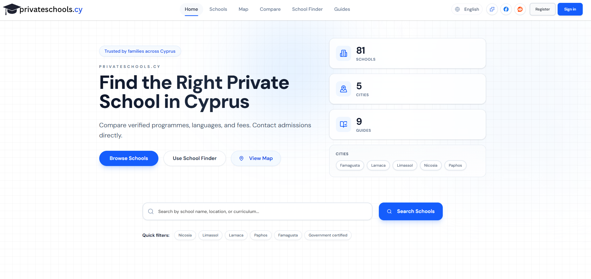

  

# PrivateSchools.cy

PrivateSchools.cy is a Cyprus private schools directory and parent resource for private schools and international schools in Cyprus. Discover private schools in Nicosia, Limassol, Larnaca, Paphos, and Famagusta, then compare tuition, curricula, language of instruction, facilities, and admissions contacts in one place.

  

## 🔗 Quick links
- 🏠 Home: https://privateschools.cy
- 🗂️ Schools directory: https://privateschools.cy/schools
- 🗺️ Map view: https://privateschools.cy/map
- 🧭 Find a school quiz: https://privateschools.cy/find
- ⚖️ Compare schools: https://privateschools.cy/compare
- 📘 Parent guides: https://privateschools.cy/guides
- ✉️ Contact: https://privateschools.cy/contact
- 🧩 Chrome extension: https://chromewebstore.google.com/detail/privateschoolscy-cyprus-s/lcjciafgcfidmldpmnmkdnahdcjomfpb

## 📣 Socials
- 👾 Reddit community: https://www.reddit.com/r/CyprusPrivateSchools/
- 📘 Facebook: https://www.facebook.com/cyprusprivateschools

## ✨ Directory highlights
- ✅ Verified school profiles with tuition ranges, curricula, languages, facilities, and admissions contacts
- ✅ Filters for city, curriculum, tuition, language, and support services to shortlist the right schools
- ✅ Side-by-side comparison for up to three private schools in Cyprus
- ✅ Interactive Cyprus school map with directions for campus visits
- ✅ A four-question school finder quiz for personalized recommendations

## 🏫 School profile details
- 💶 Fees and what is included (books, exams, uniforms, activities)
- 🧒 Levels and age ranges (nursery, pre-primary, primary, middle, high school)
- 🎓 Curricula and qualifications (British IGCSE/A-Levels, IB, American AP, Greek)
- 🗣️ Languages of instruction and EAL support
- 📍 Campus location with maps and directions
- 📸 Photos, facilities, and on-campus resources
- 🎭 Programmes and activities (STEM, performing arts, sports, Montessori, gifted)
- 📝 Admissions contacts and how to apply

## 🎓 Curricula and languages
- British curriculum (IGCSE, A-Levels)
- International Baccalaureate (PYP, MYP, DP)
- American curriculum (AP)
- Greek national curriculum
- English and Greek instruction, plus bilingual options and EAL support

## 📚 Parent guides
- How to Choose the Right Private School in Cyprus: https://privateschools.cy/guides/how-to-choose-private-school
- Private School Admissions in Cyprus: https://privateschools.cy/guides/private-school-admissions-cyprus
- Private School Fees in Cyprus: https://privateschools.cy/guides/private-school-fees-cyprus
- Private School Visit Checklist: https://privateschools.cy/guides/private-school-visit-checklist
- Cyprus Private School Calendar: https://privateschools.cy/guides/cyprus-private-school-calendar
- A-Levels vs IB vs Apolytirion: https://privateschools.cy/guides/a-levels-vs-ib-vs-apolytirion
- Public or Private School in Cyprus: https://privateschools.cy/guides/public-or-private-school-cyprus
- Public vs Private School Differences in Cyprus: https://privateschools.cy/guides/public-private-school-differences-cyprus
- Bilingual Child in Cyprus: https://privateschools.cy/guides/bilingual-child-cyprus

## 🌍 Site languages
Available in English, Greek, Russian, Ukrainian, Hebrew, and Chinese.
- 🇬🇧 English: https://privateschools.cy
- 🇬🇷 Greek: https://privateschools.cy/gr
- 🇷🇺 Russian: https://privateschools.cy/ru
- 🇺🇦 Ukrainian: https://privateschools.cy/ua
- 🇮🇱 Hebrew: https://privateschools.cy/he
- 🇨🇳 Chinese: https://privateschools.cy/zh

## 🛡️ Policies
- 🔒 Privacy Policy: https://privateschools.cy/privacy
- 📜 Terms of Service: https://privateschools.cy/terms
